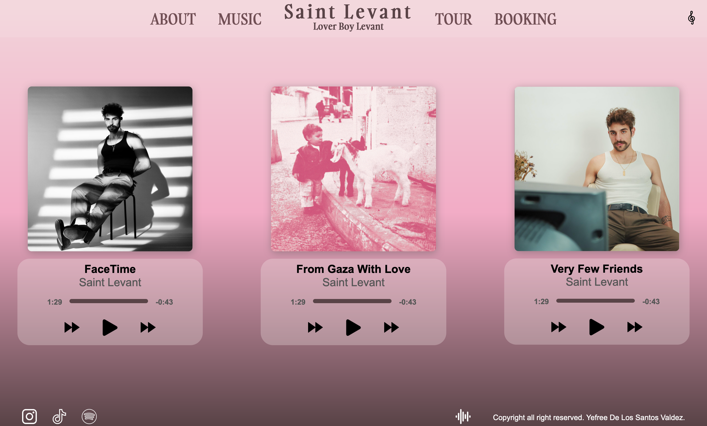

# Web Site Redesign for artist Saint Levant. (Inspired in his new album).

This a web page made with HTML, CSS (SASS) and some JavaScript. 
Wanted to create a simple and aesthetic web experience with this project. I'm currently building the web site, but the front page of the web site it's almost done. 
Feel free to check out my project.

## Table of contents

- [Overview](#overview)
  - [The challenge](#the-challenge)
  - [Screenshot](#screenshot)
  - [Links](#links)
- [My process](#my-process)
  - [Built with](#built-with)
  - [What I learned](#what-i-learned)
  - [Continued development](#continued-development)
  - [Useful resources](#useful-resources)
- [Author](#author)
- [Acknowledgments](#acknowledgments)

## Overview

### The challenge

Users should be able to:

- View the optimal layout depending on their device's screen size
- Click on every link and be able to move around the page in a user friendly way.

### Screenshot




### Links

- Repo URL: [GitHub Repository](https://github.com/yefreescoding/SaintLevant-page-redesign.git)
- Live Site URL: [Vercel Live Site](https://saint-levant-page-redesign.vercel.app/)

## My process

### Built with

- Semantic HTML5 markup
- CSS custom properties
- FlexBox
- CSS Grid
- Mobile-first workflow

### What I learned

Learned new and better ways to use the view port measures for a better responsive design.


```html
<h1>Some HTML code I'm proud of</h1>
```
```css
header {
  height: 100svh;
}
```
```js
const proudOfThisFunc = () => {
  console.log('🎉')
}
```

### Continued development
The next step will be finish the other pages of the web page.

### Useful resources

- [Example resource 1]() - This helped me for XYZ reason. I really liked this pattern and will use it going forward.

## Author

- GitHub Account - [Yefree Valdez](https://github.com/yefreescoding)
- Twitter - [@YefreeCodes](https://twitter.com/YefreeCodes)


## Acknowledgments

This is where you can give a hat tip to anyone who helped you out on this project. Perhaps you worked in a team or got some inspiration from someone else's solution. This is the perfect place to give them some credit.
